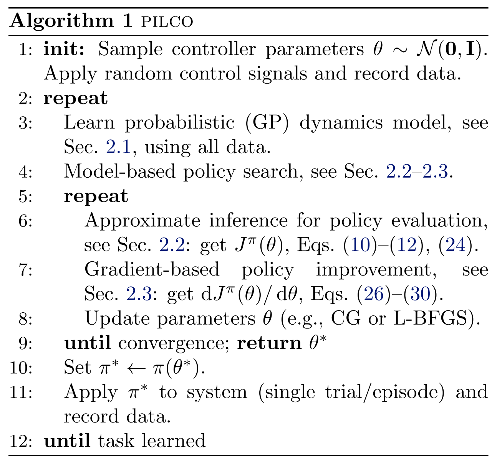
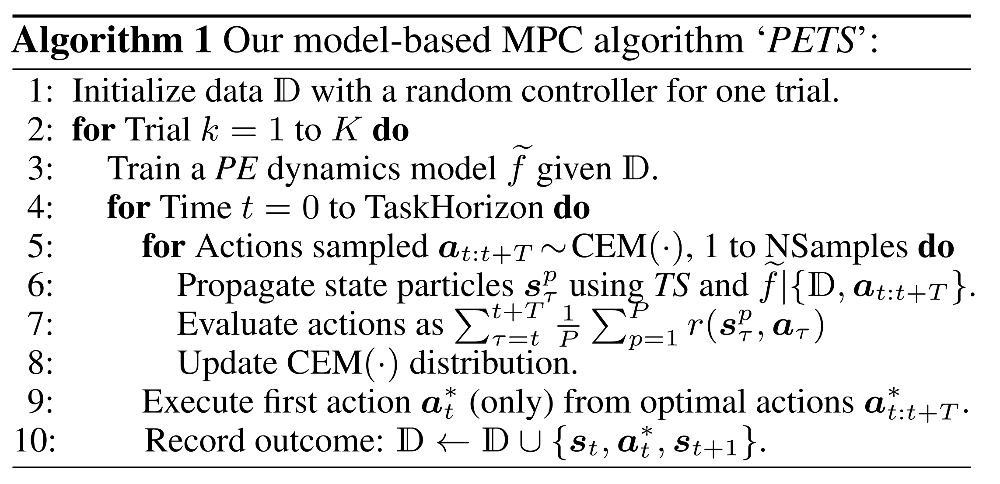

# Model-based RL with uncertainty

Model-based 方法相较于Model-free 方法有着较好的 **sample efficiency**，但是由于对 Model 学习不足而引入的 bias 也会对后续的学习过程造成不可忽视的影响。

这里挑选介绍三篇以 model uncertainty 为主题解决该问题的文章。

### Reference

- PILCO: A Model-Based and Data-Efficient Approach to Policy Search. [[PDF]](http://mlg.eng.cam.ac.uk/pub/pdf/DeiRas11.pdf)[[Code]](https://github.com/nrontsis/PILCO)
- Improving PILCO with Bayesian Neural Network Dynamics Models. [[PDF]](http://mlg.eng.cam.ac.uk/yarin/PDFs/DeepPILCO.pdf)[[Code]](https://github.com/zuoxingdong/DeepPILCO)
- Deep Reinforcement Learning in a Handful of Trials using Probabilistic Dynamics Models. [[PDF]](https://arxiv.org/pdf/1805.12114.pdf)[[Code]](https://github.com/kchua/handful-of-trials)

## 1. PILCO: A Model-Based and Data-Efficient Approach to Policy Search

### 1.1 Motivation

model-based方法有着较好的efficiency，但存在一定的局限性：**model bias**（对于小样本&无先验，这个问题更为严重），使用有bias的model去预测，进而会带来更大的误差。

### 1.2 Solution

学习一个probabilistic dynamics model，这样的model能够 express uncertainty，而不是直接丢弃 uncertainty。只要有了这种**可表示 uncertainty**，便能进一步用不同的方法来尝试削弱model bias的影响。

在PILCO中，使用了**高斯过程回归（gaussian process regression）**来学习这个probabilistic dynamics model。

基于所学到的model，不做rollout，而是直接计算

$$
J^\pi=\mathbb{E}_{\mathbf{x}_{t}}\left[c\left(\mathbf{x}_{t}\right)\right]=\int c\left(\mathbf{x}_{t}\right) \mathcal{N}\left(\mathbf{x}_{t} \mid \mu_{t}, \mathbf{\Sigma}_{t}\right) \mathrm{d} \mathbf{x}_{t}
$$

之后采用基于梯度($\frac{\mathrm{d}J}{\mathrm{d}\theta}$)的Policy Search，找到最优参数，使得

$$
\theta^* = {\arg\min}_\theta J^{\pi_\theta}
$$

此时得到$\pi^*=\pi_{\theta^*}$

## 2. Improving PILCO with Bayesian neural network dynamics models

### 2.1 Motivation

GP regression不适合对复杂环境（e.g. 高维度）建模。

### 2.2 Solution

主要考虑是将regression替换为NN (Neural Network)，但需要解决带来的两个问题：Output Uncertainty & Input Uncertainty

**1) Output Uncertainty**

将GP regression 替换为NN，能够进行更复杂的建模，但一般的NN不能express model uncertainty，考虑使用BNN (Bayesian Neural Network) 。

**2) Input Uncertainty**

PILCO因为使用了GP regression，因此可以analytically propagates state distributions through the dynamics model, i.e. 推导出分布 $p(X_0),\ldots ,p(X_T)$，这些分布能够表示不确定的input $X_0,\ldots,X_T$。

但若使用BNN，他的输入层只能接受确定性的input，无法表示所需要的不确定性，因此考虑使用**particle methods**：

## 3. Deep Reinforcement Learning in a Handful of Trials using Probabilistic Dynamics Models

### 3.1 Motivation

和上一篇一样在解决PILCO的complexity问题

### 3.2 Solution

整体的核心思想和上一篇DeepPILCO一样：用更复杂的NN来代替GP regression，并解决所带来的 uncertainty 问题，不过这一篇的实验结果要优于上一篇。

#### 3.2.1 PE (Probabilistic Ensemble)

**1) aleatoric (inherent system stochasticity)**

使用probabilistic NN来解决aleatoric uncertainty（上一篇的output uncertainty）

与Bayesian NN不同的是，这篇文章使用了 log prediction probability 来express uncertainty：

$$
\operatorname{loss}_{\mathrm{P}}(\boldsymbol{\theta})=-\sum_{n=1}^{N} \log \tilde{f}_{\boldsymbol{\theta}}\left(\boldsymbol{s}_{n+1} \mid \boldsymbol{s}_{n}, \boldsymbol{a}_{n}\right)
$$

该NN的input是$\boldsymbol{s},\boldsymbol{a}$，output为$\tilde{f}_\theta$，是一个parameterized distribution。

**2) epistemic (subjective uncertainty, due to limited data)**

使用Ensemble来解决epistemic uncertainty

核心思想就是对多个Probabilistic NN进行ensemble：consider ensembles of $B$-many bootstrap models, using $\theta_b$ to refer to the parameters of our $b^{\mathrm{th}}$ model $\tilde{f}_{\theta_b}$, then get

$$
\tilde{f}_{\theta}=\frac{1}{B}\sum_{b=1}^{B}\tilde{f}_{\theta_b}
$$

#### 3.2.2 TS (trajectory sampling)

create P particles from the current state, $s_{t=0}^p=s_0 \forall p$，每个particle都服从分布进行传播：$\boldsymbol{s}_{t+1}^{p} \sim \widetilde{f}_{\boldsymbol{\theta}_{b(p, t)}}\left(\boldsymbol{s}_{t}^{p}, \boldsymbol{a}_{t}\right)$，其中particle的选择是基于一个bootstrap $b(p,t)\in\{1,\ldots,B\}$，最终将P组Particles采集到的结果进行ensemble。

