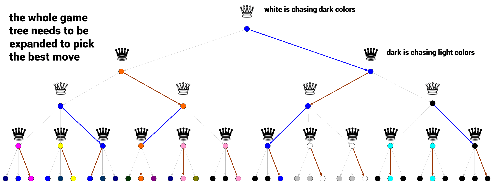
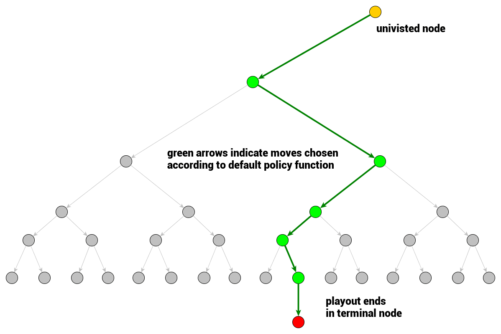
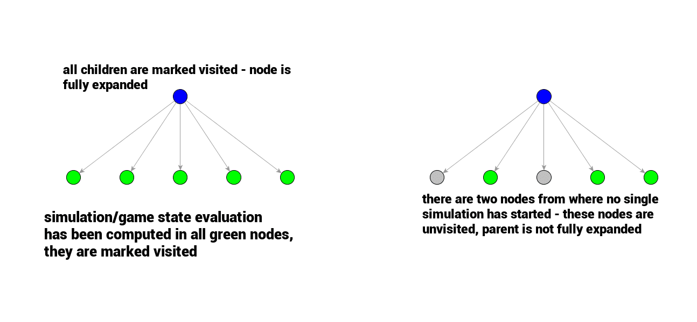
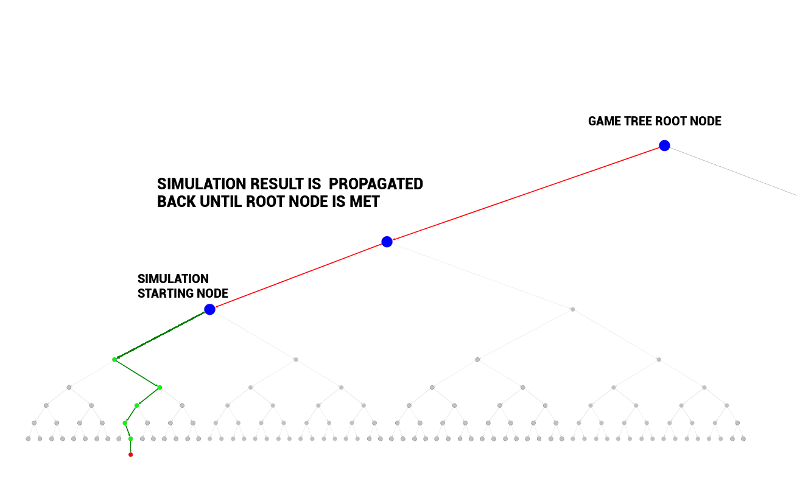
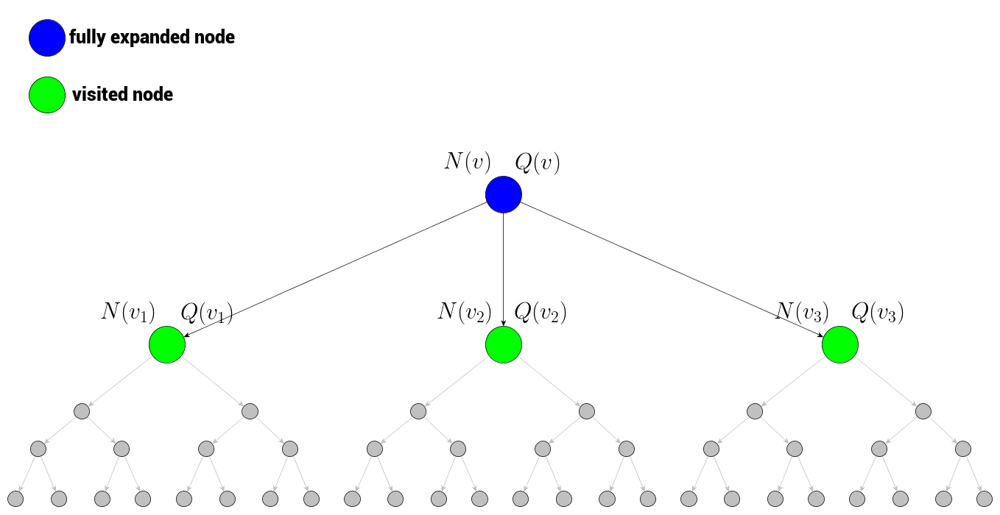
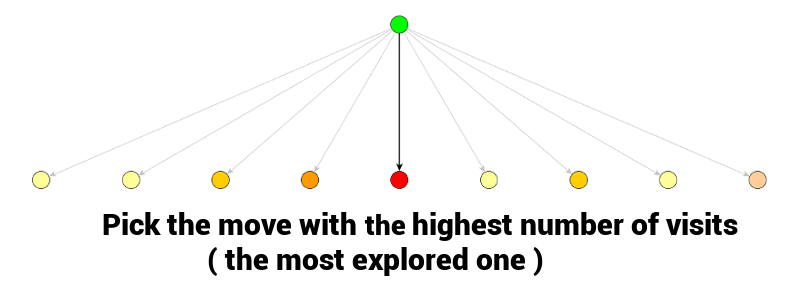

# 蒙特卡罗树搜索（MCTS） - 介绍

第八章对蒙特卡罗树搜索（MCTS）这一重要算法一带而过，没有仔细讲解，这里补充一点 MCTS 方面的一点介绍。

蒙特卡洛树搜索的主要目的：给出一个『**游戏状态**』并选择『**胜率最高的下一步**』。


## **有限两人零和回合制游戏**

蒙特卡洛树搜索运行的框架 / 环境是『游戏』，其本身是一个非常抽象的广义术语，这里只针对于一种游戏类型——有限两人零和回合制游戏：

- 『**游戏**』意味着处理互动情况。
- 『**有限**』表示在任何时间点上，玩家之间都有有限的互动。
- 『**两人**』表示参与者只有两位。
- 『**回合制**』表示玩家按照一定顺序进行游戏。
- 『**零和游戏**』意味着游戏双方有着相反的目标，换句话说：在游戏的任何终结状态下，所有玩家获得的总和等于零。有时这样的游戏也被称为严格竞争博弈。

围棋、国际象棋等都是有限两人零和回合制游戏。


## **为何采用 MCTS ？**

MCTS其实是在线规划（online planning）的一种，从当前局面出发，以非参数方式估计**局部** Q 函数，然后用局部 Q 函数估计去决定下一次采取哪个 action 。

由于是规划（planning），MCTS的限制就是得要知道环境的全部信息，即有完美的前向模型（forward model），这样才能知道走完一步后是什么状态。围棋这类『**有限两人零和回合制游戏**』因为规则固定，状态清晰，有完美快速的前向模型，所以 MCTS是 个好的选择。


## **如何表征一个博弈**

可以使用一种著名的数据结构以简单的形式来表征一个博弈：博弈树。


在上图的井字棋博弈树（部分展示）的例子中：

- 顶部为树的根节点，表示井字棋博弈的初始状态，即空白棋盘（标记为绿色）；
- 任何从一个节点向另一个节点的转换被称为一个 action ；
- 井字棋的分支因子是变化的，它依赖于树的深度；
- 从一个根节点到一个端节点的树遍历表征了单个博弈过程。


## **MiniMax 策略和 alpha-beta 剪枝算法**

如何利用博弈树寻找最有潜力的下一步行动？首先不能提前知道对手的策略，如果完全不了解对手，那么可以使用一种非常保守的策略—— MiniMax 算法：在假定你的对手执行最佳行动的前提下，最大化你的收益，也可以说在各种获得最小收益的策略中选择有最大收益的策略。


这种方法以放弃最优策略为代价，从而最小化了风险，因此它是一种非常保守的方法。在 A 和 B 的两人有限零和序列博弈中（其中 A 尝试最大化其收益，而 B 尝试最小化 A 的收益），极小极大算法可以用以下的递归形式来描述：

$$
\begin{aligned}
v_A(s_i)=\max_{a_i}v_B(\mathrm{move}(s_i,a_i))\\
v_B(s_i)=\min_{a_i}v_A(\mathrm{move}(s_i,a_i))
\end{aligned}
$$

其中：

- $v_A$ 和 $v_B$ 分别是玩家 A 和玩家 B 的收益函数
- move 是一个函数，它在给定当前状态 $s_i$ 和在该状态的动作 $a_i$ 下，生成下一个博弈状态（当前节点的子节点之一）

简单来说，给定状态 s，并假定对手尝试最小化你的收益，你希望找到能最大化收益的动作 $a_i$。我们需要做的就是展开整个博弈树，并反向传播由递归形式的规则得到的值。





上图中的博弈树展示了极小极大算法中的最佳行动选择过程。白棋希望博弈的结果尽可能黑，而黑棋希望博弈的结果尽可能白。

- 每一个层级的选择都是极小极大判断的最优结果。我们可以从底部的终端节点开始，其中的选择是很明显的。黑棋将总是选择最明亮的颜色，然后白棋将寻找最大的奖励并选择到达最暗颜色的路径。

- 极小极大算法的最大弱点是它需要展开整个博弈树。对于有高分支因子的博弈（例如围棋或国际象棋），该算法将导致巨大的博弈树，使得计算无法进行。


**两种解决办法：**

1. 仅在确定的深度 d 内展开博弈树，但是需要一个函数来评估非终端博弈状态。

2. 通过 alpha-beta 剪枝算法来修剪博弈树。alpha-beta 剪枝是提升版的极小极大算法，它以极小极大算法的形式遍历博弈树，并避免某些树分支的展开，其得到的结果在最好的情况下等于极小极大算法的结果。alpha-beta 剪枝通过压缩搜索空间提高搜索效率。


## **蒙特卡洛树搜索的基本概念**

蒙特卡洛树搜索的主要概念是**搜索**，即沿着博弈树向下的**一组遍历过程**。顾名思义，蒙特卡洛树搜索会多次**模拟**博弈，并尝试根据模拟结果**预测最优方案**。


## **模拟**

模拟即**单次博弈策略**，在模拟中，行动可以通过 rollout 策略函数选择：

$$
\text{RolloutPolicy:} s_i\rightarrow a_i
$$

该函数将输入一个博弈状态，并产生下一次行动的选择。在实践中，该函数会设计为允许很多次模拟快速进行，一般默认的 rollout 策略函数可以是服从均匀分布的随机采样。

```python
def rollout(node):
    while non_terminal(node):
        node = rollout_policy(node)
    return result(node)

def rollout_policy(node):
    return pick_random(node.children)
```





## **博弈树的展开节点、完全展开节点和访问节点**

给定一个根节点并加上博弈的规则，那么博弈树的其余部分就已经隐含表示出来了。我们可以遍历它而不需要将整棵树储存在内存中。

在最初的根节点中，它是完全**未展开**的，其余所有节点都没有被访问。一旦需要执行一个行动，就需要考虑之后会产生怎样的结果，因此访问一个节点后，需要分析该节点带来的效用。

所有节点可以分为访问或未访问，如果某节点的所有子节点都是已访问节点，那么它就可视为**完全展开**的节点，反之**未完全展开**的节点。




在实践中，搜索开始时，根节点的所有子节点都未被访问。然后一个节点被选中，第一个模拟（评估）就开始了。

需要注意，模拟过程中 rollout 策略函数选择的节点并未被访问，只有模拟**起始节点**是被访问的状态。


## **反向传播：将模拟结果传播回去**

当初次访问节点的模拟结束后，其结果会反向传播至当前博弈树的根节点，**模拟开始的节点**被标注为已访问。




反向传播是**从子节点（模拟开始的地方）遍历回根节点**。模拟结果被传输至根节点，反向传播**路径上的每个节点的统计数据都被计算／更新**。

反向传播保证每个节点的数据都会反映开始于其所有子节点的模拟结果。

```python
def backpropagate(node, result):
   if is_root(node) return
   node.stats = update_stats(node, result)
   backpropagate(node.parent)
```


## **节点的统计数据**

反向传播模拟结果的目的是更新反向传播路径（包括模拟起始的节点）上所有节点 $v$ 的总模拟奖励 $Q(v)$ 以及总访问次数 $N(v)$。

- $Q(v)$ 即总模拟奖励，在最简单的形式中是通过考虑的节点得到的模拟结果的总和。
- $N(v)$ 即总访问次数，表示节点 $v$ 位于反向传播路径上的次数（即它对总模拟奖励做出了多少次贡献）。

每个被访问节点都会保存这两个值，一旦完成了确定次数的模拟之后，被访问的节点就保存了它们被利用/探索（expolited/explored）的信息。

这两个值将反映该节点的潜在价值（总模拟奖励）和它被探索的程度（总访问次数）。高奖励的节点是很好的可利用候选，而那些访问次数少的节点也可能是有价值的（因为它们尚未得到很好的探索）。


## **博弈树遍历**

如何从一个根节点到达一个未访问节点，来启动一次模拟？在搜索最开始的时候，由于我们还没有进行任何模拟，所以先选择未被访问的节点。在每个未被访问的节点上进行单次模拟，结果被反向传播至根节点，然后根节点即被认为经过了完全展开。

但是接下来怎么做呢？现在我们如何从完全展开的节点导向未被访问的节点呢？我们必须遍历被访问节点的层，目前没有很好的继续进行的方式。

为了在路径中找到下一个节点，以通过完全展开的节点 v 开始下一次模拟，我们需要考虑 v 所有子节点 $v_1, v_2, …, v_k$ 的信息，以及节点 v 本身的信息。现在我们来思考一下可用信息有哪些：




当前节点（蓝色）是完全展开的，因此它必须经过访问，以存储节点数据：它及其子节点的总模拟奖励和总访问次数。这些值是为了最后一部分：树的置信上限（UCT）做准备。


## **树的置信上限**

UCT 是一个函数，使我们在被访问节点中**选择下一个要遍历的节点**，这也是蒙特卡洛树搜索的**核心函数**：

$$
\mathbb{UCT}(v_i,v)=\frac{Q(v_i)}{N(v_i)}+c\sqrt{\frac{\log(N(v))}{N(v_i)}}
$$

UCT 最大的节点就是蒙特卡洛树搜索遍历过程中选择的节点，该函数关于节点 v 及其子节点 $v_i$ 定义，包括两个部分：

- $\dfrac{Q(v_i)}{N(v_i)}$ ， exploitation
- $c\sqrt{\frac{\log(N(v))}{N(v_i)}}$，exploration

参数 c 控制蒙特卡洛树搜索中 expolitation 和 exploration 部分之间的权衡。


```python
def traverse(node):
	while fully_expanded(node):
		node = best_uct(node)
	return pick_unvisted(node.children) or node
```


## **终止蒙特卡洛树搜索**

MCTS 的终止时间需要结合问题背景来确定。

- 如果『思考时间』有限，或计算能力有限，则需要给定一个深度阈值。
- 如果资源允许，可以考虑一直运行 MCTS。

一旦 MCTS 过程结束，最好的一步通常是具备最高访问量 $N(v_i)$ 的一步，因为它的奖励值评估结果最好（评估值必然很高，因为它被探索的频率最高）。





```python
def best_child(node):
    pick child with highest number of visits
def monte_carlo_tree_search(root):
    while resources_left(time,computational power):
        leaf = traverse(root)
        simulation_result = rollout(leaf)
        backpropagate(leaf, simulation_result)
    return best_child(root)
```

