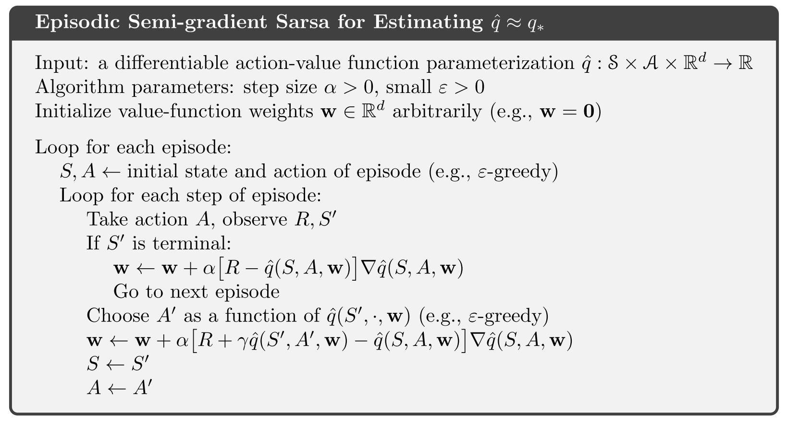
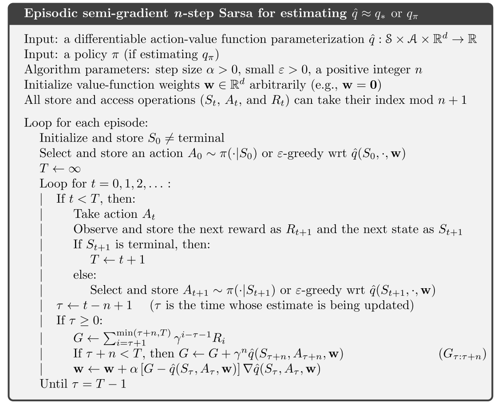
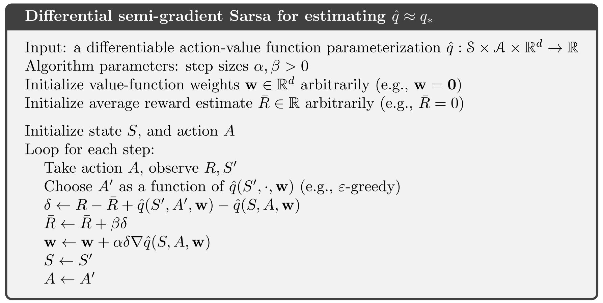
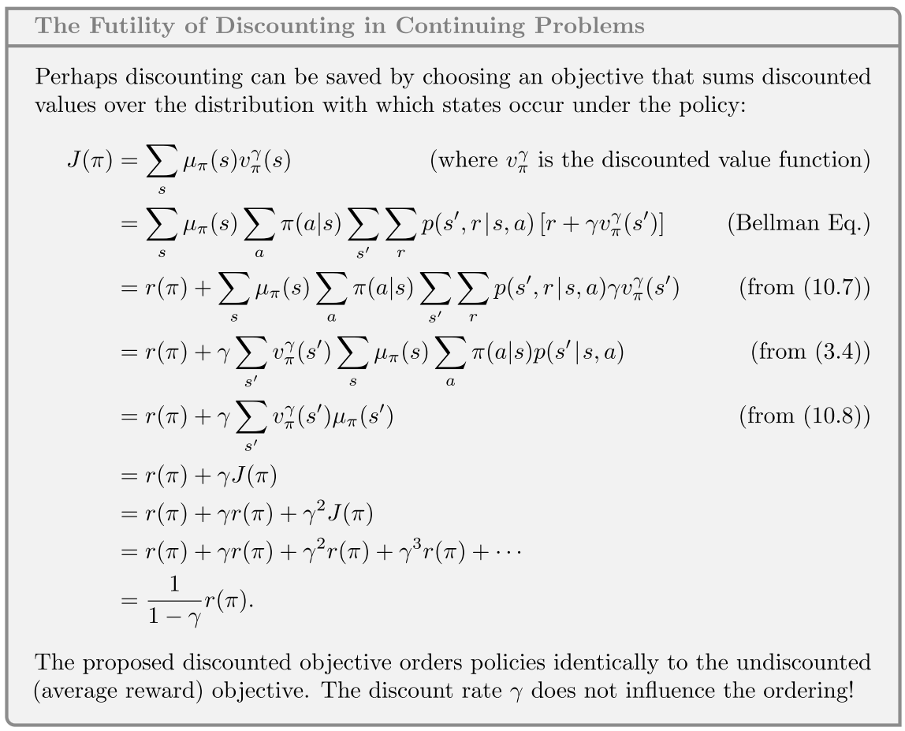
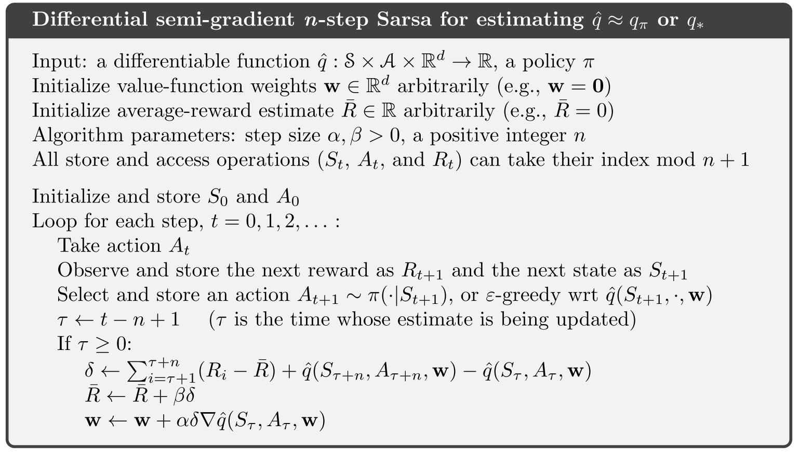

# 强化学习导论（十）- On-Policy的近似控制

第九章是在讲 prediction 问题，也就是如何对 value function 估值，这一章主要在其基础上关注 control 问题，也就是结合了 policy improvement 和 action select 的问题。

## 10.1 Episode Semi-gradient Control

这一节对 Q 函数进行估计：$\hat{q}\approx q_\pi$ ，同样也是关于权向量 $\mathbf{w}$ 的参数化函数，此时用于训练的样本由前一节的 $S_t\mapsto U_t$ 变为 $S_t,A_t\mapsto U_t$ 。

对于 one-step sarsa，梯度更新式为：

$$
\mathbf{w}_{t+1}\doteq\mathbf{w}_t+\alpha[R_{t+1}+\gamma\hat{q}(S_{t+1},A_{t+1},\mathbf{w}_t)-\hat{q}(S_t,A_t,\mathbf{w}_t)]\nabla\hat{q}(S_t,A_t,\mathbf{w}_t)
$$

为了构成 control 问题，需要将以下几步结合起来：

- action-value prediction
- policy improvement
- action selection

## 10.2 n-step Semi-gradient Sarsa

令 $U_t=G_{t:t+n}$ ，即为 n-step semi-gradient sarsa 算法，其中

$$
G_{t:t+n}\doteq R_{t+1}+\gamma R_{t+2}+\cdots+\gamma^{n-1}R_{t+n}+\gamma^n\hat{q}(S_{t+n},A_{t+n},\mathbf{w}_{t+n-1})
$$

更新式为

$$
\mathbf{w}_{t+n}\doteq \mathbf{w}_{t+n-1}+\alpha[G_{t:t+n}-\hat{q}(S_t,A_t,\mathbf{w}_{t+n-1})]\nabla\hat{q}(S_t,A_t,\mathbf{w}_{t+n-1})
$$

## 10.3 Average Reward: A New Problem Setting for Continuing Tasks

为满足『有限马尔可夫决策过程（MDP）』中的『有限』这一条件，我们之前是采用了 episodic setting（片段式） 以及 discounted setting（带削减系数） 两种方案，这里再介绍一种新的方案—— average reward setting 。

- 与 discounted setting 类似，average reward setting 也是不停止地与环境交互，用于没有开始、终止状态的连续型问题。
- 与 discounted setting 不同，average reward setting 没有削减系数，对任何时刻 reward 的重视程度一致。

在 average reward setting 中，策略 $\pi$ 的好坏程度由 reward 的平均情况决定（而不是之前的总期望收益）：

$$
\begin{aligned}
r(\pi)&\doteq\lim_{h\to\infty}\frac{1}{h}\sum_{t=1}^h\mathbb{E}[R_t|A_{0:t-1}\sim\pi]\\
&=\lim_{t\to\infty}\mathbb{E}[R_t|A_{0:t-1}\sim\pi]\\
&=\sum_s\mu_\pi(s)\sum_a\pi(a|s)\sum_{s',r}p(s',r|s,a)r
\end{aligned}
$$

其中 $\mu_\pi(s)\doteq\lim\limits_{t\to\infty}\mathrm{Pr}\{S_t=s|A_{0:t-1}\sim\pi\}$ 为稳态分布，并且假定对于任意策略 $\pi$ 都有 $\mu_\pi$ 存在。称这个性质为『遍历性（ergodicity）』。

> 补充：上式第 1 行到第 2 行其实用的是数学分析里的一个性质：
>
> $$\lim_{n\to \infty}a_n= a \Rightarrow \lim_{n\to\infty}\frac{a_1+a_2+\ldots + a_n}{n}=a$$

遍历性意味着 MDP 的开始位置以及任何早期决策带来的影响都只是暂时性的，长期而言，期望收益仅取决于**策略**和**状态转移概率**。

$\mu_\pi$ 有个特点，根据策略 $\pi$ 执行某个 action 所进入的新状态仍为同一分布：

$$
\sum_s\mu_\pi(s)\sum_a\pi(a|s)p(s'|s,a)=\mu_\pi(s')
$$

在 average reward setting 中，return 的定义为

$$
G_t\doteq R_{t+1}-r(\pi) +R_{t+2}-r(\pi)+R_{t+3}-r(\pi)+\cdots
$$

称这种 return 为 differential return，对应的 value function 为 differential value function 。

$$
\begin{aligned}
v_\pi(s)&=\sum_a\pi(a|s)\sum_{r,s'}p(s',r|s,a)[r-r(\pi)+v_\pi(s')]\\
q_\pi(s,a)&=\sum_{r,s'}p(s',r|s,a)[r-r(\pi)+\sum_{a'}\pi(a'|s')q_\pi(s',a')]\\
v_*(s)&=\max_a\sum_{r,s'}p(s',r|s,a)[r-\max_\pi r(\pi)+v_*(s')]\\
q_*(s,a)&=\sum_{r,s'}p(s',r|s,a)[r-\max_\pi r(\pi)+\max_{a'}q_*(s',a')]
\end{aligned}
$$

同样可定义差值形式的 TD error：

$$
\begin{aligned}
\delta_t&\doteq R_{t+1}-\bar{R}_{t+1}+\hat{v}(S_{t+1},\mathbf{w}_t)-\hat{v}(S_t,\mathbf{w}_t)\\
\delta_t&\doteq R_{t+1}-\bar{R}_{t+1}+\hat{q}(S_{t+1},A_{t+1}\mathbf{w}_t)-\hat{q}(S_t,A_t,\mathbf{w}_t)
\end{aligned}
$$

## 10.4 Deprecating the Discounted Setting

在本章背景下，原先的 discounted setting 存在一些问题（下面会讲），所以需要用 average reward setting 来取代 discounted setting 。

假设有一段没有起始点和终点的 episode ，下面证明两种方案的评价值是成正比的：

可以看出，在 on-policy 分布下，$J(\pi)$ 和 $r(\pi)$ 成正比关系，然而通过 $r(\pi)$ 对策略优劣的排序结果是固定的，显然 $J(\pi)$ 选出的策略顺序也相同，这说明削减系数 $\gamma$ 对于决策选择行动没有实质性的影响，discounted setting 在这时便失去了一些使用价值，所以需要做出一些改变。

## 10.5 n-step Differential Semi-gradient Sarsa

在 average reward setting 下，可定义 n-step TD return 为：

$$
G_{t:t+n}\doteq R_{t+1}-\bar{R}_{t+1}+\cdots+R_{t+n}-\bar{R}_{t+n}+\hat{q}(S_{t+n},A_{t+n},\mathbf{w}_{t+n-1})
$$

同时也有 n-step TD error ：

$$
\delta_t\doteq G_{t:t+n}-\hat{q}(S_t,A_t,\mathbf{w})
$$

