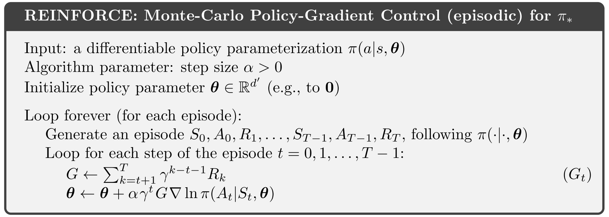
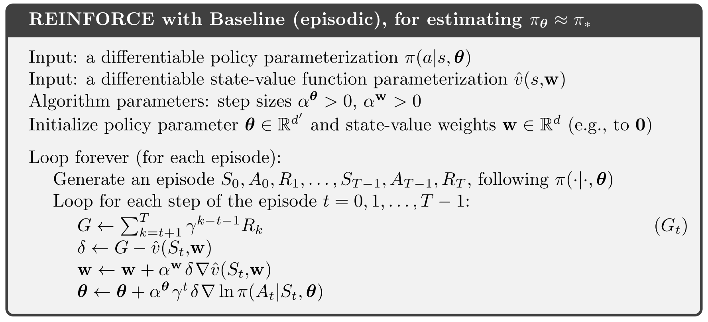
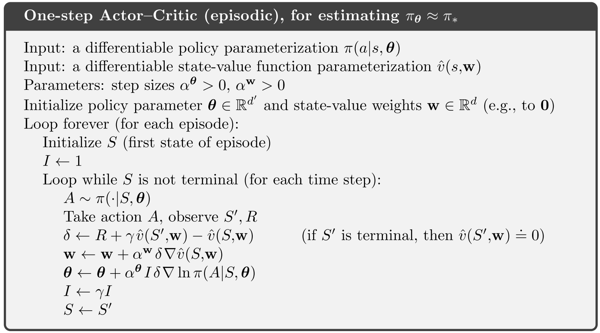

# 强化学习导论（十三）- 策略梯度法

之前一直在讲 action-value 方法，它们都依赖于对 action-value 的估计，而本章的方法将考虑直接去学习『参数化策略』，这样就能不通过 value function 来选择 action 。

$$
\pi ( a | s , \boldsymbol { \theta } ) = \operatorname { Pr } \left\{ A _ { t } = a | S _ { t } = s , \boldsymbol { \theta } _ { t } = \boldsymbol { \theta } \right\}
$$

本章主要考虑对度量函数 $J ( \boldsymbol { \theta } )$ 的梯度（关于策略参数 $\boldsymbol { \theta }$ ）来学习，来最大化 performance ，因此参数更新式即为对 $J$ 的梯度上升：

$$
\boldsymbol { \theta } _ { t + 1 } = \boldsymbol { \theta } _ { t } + \alpha \widehat { \nabla J \left( \boldsymbol { \theta } _ { t } \right) }
$$

其中，$\widehat { \nabla J \left( \boldsymbol { \theta } _ { t } \right) } \in \mathbb { R } ^ { d ^ { \prime } }$ 是对梯度的一个估计，其期望值为该梯度。所有满足该通式的方法，均称为『policy gradient methods』。

有些方法，既学习了 policy ，也同时学了 value function ，称这样的方法为『actor-critic methods』，其中『actor』指所学的 policy，『critic』指所学的 value function 。

下面具体介绍 Policy Gradient Methods 。

## **13.1 Policy Approximation and its Advantages**

对于不太大的离散 action 空间，若要将 policy 参数化，一个很自然的方法是对每个 state-action 来构造一个参数化的数值偏好 $h(s, a, \boldsymbol{\theta}) \in \mathbb{R}$ ，进而通过指数 soft-max 函数来得到分布

$$
\pi(a | s, \boldsymbol{\theta}) \doteq \frac{e^{h(s, a, \boldsymbol{\theta})}}{\sum_{b} e^{h(s, b, \boldsymbol{\theta})}}
$$

称这样参数化得到的 policy 为『soft-max in action preferences』。

action preferences 可以被任意参数化。既可以用神经网络来计算（ $\boldsymbol{\theta}$ 作为网络的权重），也可以简单地使用线性模型 $h(s, a, \boldsymbol{\theta})=\boldsymbol{\theta}^{\top} \mathbf{x}(s, a)$ 。

Policy Approximation 有几个优点：

- 第一个优势是，即使对于 deterministic policy（确定性策略，明确选择某个具体 action 的策略），参数化策略也能足够逼近（比如将某个 a 对应的 $h(s,a,\boldsymbol{\theta})$ 设为无穷大即可），而传统的 $\varepsilon$-greedy 策略则不能做到，因为它必须对非最优策略分配 $\varepsilon$ 的概率。
- 第二个优势是能灵活地任意分配 action 的概率，对于一些特殊情况，比如不完全信息下的卡牌游戏，最佳 policy 对应的选择随机性很强，能够对两种差异很大的 action 来分配概率进而做出选择，比如在 Poker 中进行 bluffing 时（bluff 指在自己手牌较弱时加注以试图吓退对方），这对于 action-value 方法而言很难做到，从书中 example 13.1 中可以简单明了的看出两类方法的效果差异。
- 第三个优势是，参数化的 policy 是一个相对更易于近似的函数(Simsek, Algorta, and Kothiyal, 2016)。
- 最后一个优势是，参数化的 policy 能较好地将先验知识引入强化学习系统，这通常也是选择 policy-based learning method 的重要原因。

## **13.2 The Policy Gradient Theorem**

参数化 policy 除了上一节提到的几点实用价值外，还有一个重要的理论优势。对于连续的参数化 policy ，action 的概率可以连续性地改变，而 $\varepsilon$-greedy 方法中选择 action 的概率则有可能因小变动而发生突变，主要是由于 policy-gradient methods 有着更强的收敛性。

这一节先只考虑 episodic 形式的问题，不失一般性，先假定每一段 episode 都起始于指定状态 $s_0$ ，定义 performance：

$$
J(\boldsymbol{\theta}) \doteq v_{\pi_{\boldsymbol{\theta}}}\left(s_{0}\right)
$$

其中 $v_{\pi_{\boldsymbol{\theta}}}\left(s_{0}\right)$ 是 $\pi_\theta$ 的 **true** value function ，其中策略由 $\boldsymbol{\theta}$ 决定。为简化证明，后面的推导中假定 $\gamma=1$ （但描述算法时则写回一般形式）。

『**Policy Gradient Theorem**』：

$$
\nabla J(\boldsymbol{\theta}) \propto \sum_{s} \mu(s) \sum_{a} q_{\pi}(s, a) \nabla \pi(a | s, \boldsymbol{\theta})
$$

推导过程如下 (episodic case)

$$
\begin{aligned} \nabla v_{\pi}(s) &=\nabla\left[\sum_{a} \pi(a | s) q_{\pi}(s, a)\right], \quad \text { for all } s \in \mathcal{S} \\ &=\sum_{a}\left[\nabla \pi(a | s) q_{\pi}(s, a)+\pi(a | s) \nabla q_{\pi}(s, a)\right] \\ &=\sum_{a}\left[\nabla \pi(a | s) q_{\pi}(s, a)+\pi(a | s) \nabla \sum_{s^{\prime}, r} p\left(s^{\prime}, r | s, a\right)\left(r+v_{\pi}\left(s^{\prime}\right)\right)\right]
\\&=\sum_{a}\left[\nabla \pi(a | s) q_{\pi}(s, a)+\pi(a | s) \sum_{s^{\prime}} p\left(s^{\prime} | s, a\right) \nabla v_{\pi}\left(s^{\prime}\right)\right] \\&= \sum_{a}\Bigg[\nabla \pi(a | s) q_{\pi}(s, a)+\pi(a | s) \sum_{s^{\prime}} p\left(s^{\prime} | s, a\right)  \\ &\times \sum_{a^{\prime}}\left[\nabla \pi\left(a^{\prime} | s^{\prime}\right) q_{\pi}\left(s^{\prime}, a^{\prime}\right)+\pi\left(a^{\prime} | s^{\prime}\right) \sum_{s^{\prime \prime}} p\left(s^{\prime \prime} | s^{\prime}, a^{\prime}\right) \nabla v_{\pi}\left(s^{\prime \prime}\right)\right] \Bigg]\\
&=\sum_{x \in \mathcal S} \sum_{k=0}^{\infty} \operatorname{Pr}(s \rightarrow x, k, \pi) \sum_{a} \nabla \pi(a | x) q_{\pi}(x, a)
\end{aligned}
$$

上一步是将前式反复展开得来，其中 $\operatorname{Pr}(s \rightarrow x, k, \pi)$ 表示在策略 $\pi$ 下，从状态 s 经过 k 步达到状态 x 的转移概率，于是可得

$$
\begin{aligned} \nabla J(\boldsymbol{\theta}) &=\nabla v_{\pi}\left(s_{0}\right) \\ &=\sum_{s}\left(\sum_{k=0}^{\infty} \operatorname{Pr}\left(s_{0} \rightarrow s, k, \pi\right)\right) \sum_{a} \nabla \pi(a | s) q_{\pi}(s, a) \\ &=\sum_{s} \eta(s) \sum_{a} \nabla \pi(a | s) q_{\pi}(s, a) \\ &=\sum_{s^{\prime}} \eta\left(s^{\prime}\right) \sum_{s} \frac{\eta(s)}{\sum_{s^{\prime}} \eta\left(s^{\prime}\right)} \sum_{a} \nabla \pi(a | s) q_{\pi}(s, a) \\ &=\sum_{s^{\prime}} \eta\left(s^{\prime}\right) \sum_{s} \mu(s)\sum_a\nabla\pi(a|s) q_{\pi}(s, a) \\ & \propto \sum_{s} \mu(s) \sum_{a} \nabla \pi(a | s) q_{\pi}(s, a) \end{aligned}
$$

证毕。

关于 $\eta(s)$ 和 $\mu(s)$ ，之前已在第 9、10 章有过相关定义：
$$
\begin{aligned}
\eta(s)&=h(s)+\sum_{\overline{s}} \eta(\overline{s}) \sum_{a} \pi(a | \overline{s}) p(s | \overline{s}, a), \text { for all } s \in \mathcal{S}\\
\mu(s)&=\frac{\eta(s)}{\sum_{s^{\prime}} \eta\left(s^{\prime}\right)}, \text { for all } s \in \mathcal{S}
\end{aligned}
$$

## **13.3 REINFORCE: Monte Carlo Policy Gradient**

下面开始介绍 policy-gradient 的学习算法。回想一开始的目标是要得到随机梯度上升的形式，且希望样本梯度的期望恰好为度量函数的梯度，而 policy gradient theorem 给出的公式恰好满足，注意到公式右侧是一个关于 $\mu(s)$ （其含义是在服从策略 $\pi$ 时，各状态 s 发生的概率）的加权和，因此有

$$
\begin{aligned} \nabla J(\boldsymbol{\theta}) & \propto \sum_{s} \mu(s) \sum_{a} q_{\pi}(s, a) \nabla \pi(a | s, \boldsymbol{\theta}) \\ &=\mathbb{E}_{\pi}\left[\sum_{a} q_{\pi}\left(S_{t}, a\right) \nabla \pi\left(a | S_{t}, \boldsymbol{\theta}\right)\right] \end{aligned}
$$

于是我们的随机梯度上升算法可以写作：

$$
\boldsymbol{\theta}_{t+1} \doteq \boldsymbol{\theta}_{t}+\alpha \sum_{a} \hat{q}\left(S_{t}, a, \mathbf{w}\right) \nabla \pi\left(a | S_{t}, \boldsymbol{\theta}\right)
$$

其中 $\hat{q}$ 是对 $q_\pi$ 学习出来的逼近，称该算法 all-actions 方法。因为它的更新过程包含了全部 action ，有着不错的前景，但这里将重点放在传统的 REINFORCE algorithm (Willams, 1992) ，它在 t 时刻的更新只涉及到该时刻实际采取行动的 action $A_t$ ，做法是将随机变量的加权和替换为一个期望，然后来对这个期望做采样：

$$
\begin{aligned} \nabla J(\boldsymbol{\theta}) &=\mathbb{E}_{\pi}\left[\sum_{a} \pi\left(a | S_{t}, \boldsymbol{\theta}\right) q_{\pi}\left(S_{t}, a\right) \frac{\nabla \pi\left(a | S_{t}, \boldsymbol{\theta}\right)}{\pi\left(a | S_{t}, \boldsymbol{\theta}\right)}\right] \\ &=\mathbb{E}_{\pi}\left[q_{\pi}\left(S_{t}, A_{t}\right) \frac{\nabla \pi\left(A_{t} | S_{t}, \boldsymbol{\theta}\right)}{\pi\left(A_{t} | S_{t}, \boldsymbol{\theta}\right)}\right] \\ &=\mathbb{E}_{\pi}\left[G_{t} \frac{\nabla \pi\left(A_{t} | S_{t}, \boldsymbol{\theta}\right)}{\pi\left(A_{t} | S_{t}, \boldsymbol{\theta}\right)}\right] \end{aligned}
$$

上面第一步既是将随机变量 a 替换为样本 $A_t$ ，第二步是因为 $\mathbb{E}_{\pi}\left[G_{t} | S_{t}, A_{t}\right]=q_{\pi}\left(S_{t}, A_{t}\right)$ 。这样就得到了 REINFORCE update：

$$
\boldsymbol{\theta}_{t+1} \doteq \boldsymbol{\theta}_{t}+\alpha G_{t} \frac{\nabla \pi\left(A_{t} | S_{t}, \boldsymbol{\theta}_{t}\right)}{\pi\left(A_{t} | S_{t}, \boldsymbol{\theta}_{t}\right)}
$$

这样就能通过简单的采样来代替梯度。直观上也很好理解，每次的增量正比于 $G_t$ 乘上一个向量，这个向量即为参数空间中，那些能够增加 $A_t$ 在 $S_t$ 下被选中概率的参数的**方向**。于是如果 reward 较好，$A_t$ 对应的参数方向上就会得到较大幅度的更新，促进未来再被选中的概率，反之如果 reward 较差，更新的幅度就会变小，相对不如其他 action ，未来被选中的概率就会降低。

由于 REINFORCE 算法使用了完整的返回值 $G_t$ ，因此属于蒙特卡罗算法，只适用于 episodic 形式。

注意最后一行用 $\nabla \ln \pi\left(A_{t} | S_{t}, \boldsymbol{\theta}_{t}\right)$ 来代替 $\frac{\nabla \pi\left(A_{t} | S_{t}, \boldsymbol{\theta}_{t}\right)}{\pi\left(A_{t} | S_{t}, \boldsymbol{\theta}_{t}\right)}$ ，这是利用了 $\nabla \ln x=\frac{\nabla x}{x}$ 的简单性质。

## **13.4 REINFORCE with Baseline**

Policy gradient theorem 原本的形式为：

$$
\nabla J(\boldsymbol{\theta}) \propto \sum_{s} \mu(s) \sum_{a} q_{\pi}(s, a) \nabla \pi(a | s, \boldsymbol{\theta})
$$

考虑加入一个任意的 baseline $b(s)$ ：

$$
\nabla J(\boldsymbol{\theta}) \propto \sum_{s} \mu(s) \sum_{a}\left(q_{\pi}(s, a)-b(s)\right) \nabla \pi(a | s, \boldsymbol{\theta})
$$

$b(s)$ 可以是任意函数或随机变量，只要不和 a 相关即可。这样的改动显然是合理的，因为

$$
\sum_{a} b(s) \nabla \pi(a | s, \boldsymbol{\theta})=b(s) \nabla \sum_{a} \pi(a | s, \boldsymbol{\theta})=b(s) \nabla 1=0
$$

这样便能同理得到带 baseline 的 REINFORCE 更新式：

$$
\boldsymbol{\theta}_{t+1} \doteq \boldsymbol{\theta}_{t}+\alpha\left(G_{t}-b\left(S_{t}\right)\right) \frac{\nabla \pi\left(A_{t} | S_{t}, \boldsymbol{\theta}_{t}\right)}{\pi\left(A_{t} | S_{t}, \boldsymbol{\theta}_{t}\right)}
$$

加入 baseline 不会对期望有任何影响，但能够减小方差。常用的选择是将 $\hat{v}\left(S_{t}, \mathbf{w}\right)$ 作为 baseline ，好处是无需做别的计算，利用现有的量就能同时更新 $\boldsymbol \theta$ 和 $\boldsymbol w$ 。具体算法如下：

## **13.5 Actor–Critic Methods**

最开头提到过，同时学习 policy 和 value function 的算法是『actor-critic 算法』，尽管上一节的 REINFORCE-with-baseline 算法同时学习了 policy 和 value function ，但并不认为它是 actor-critic 算法，因为这个 value function 仅仅是用作 baseline ，而没起到 critic 的用处，具体而言，即是它没有用来做 bootstrapping（指通过状态估计值序列来更新状态估计值。例如用 $R_{t+1}+\gamma \hat{v}\left(S_{t+1}, \mathbf{w}\right)-\hat{v}\left(S_{t}, \mathbf{w}\right)$ 更新就是 bootstrapping，而用 $G_t -\hat{v}\left(S_{t}, \mathbf{w}\right)$ 更新则不是）。

这样区分是有意义的，因为只有通过 bootstrapping 才能引入 bias ，以及对函数近似效果的渐进依赖。前面章节有提到过，通过 bootstrapping 引入的 bias 以及对状态表示的依赖都是有益的，因为它能够减小方差，并且加速学习。而上一节的 REINFORCE-with-baseline 算法由于是 unbiased 的，容易渐进收敛到局部最优解，同时由于是 MC 方法，方差较大，学习速度较慢，且不太适合处理在线学习/连续型问题。之前章节介绍的 TD 方法恰好能够解决上面所有的缺点，所以引出了下面的 actor–critic methods with a bootstrapping critic 。

首先考虑 one-step actor-critic methods ，将 full return 替换为 one-step return:

$$
\begin{aligned} \boldsymbol{\theta}_{t+1} & \doteq \boldsymbol{\theta}_{t}+\alpha\left(G_{t : t+1}-\hat{v}\left(S_{t}, \mathbf{w}\right)\right) \frac{\nabla \pi\left(A_{t} | S_{t}, \boldsymbol{\theta}_{t}\right)}{\pi\left(A_{t} | S_{t}, \boldsymbol{\theta}_{t}\right)} \\ &=\boldsymbol{\theta}_{t}+\alpha\left(R_{t+1}+\gamma \hat{v}\left(S_{t+1}, \mathbf{w}\right)-\hat{v}\left(S_{t}, \mathbf{w}\right)\right) \frac{\nabla \pi\left(A_{t} | S_{t}, \boldsymbol{\theta}_{t}\right)}{\pi\left(A_{t} | S_{t}, \boldsymbol{\theta}_{t}\right)} \\ &=\boldsymbol{\theta}_{t}+\alpha \delta_{t} \frac{\nabla \pi\left(A_{t} | S_{t}, \boldsymbol{\theta}_{t}\right)}{\pi\left(A_{t} | S_{t}, \boldsymbol{\theta}_{t}\right)} \end{aligned}
$$

下面是算法伪码：

## **13.6 Policy Gradient for Continuing Problems**

在第十章中，对于没有 episode 界限的连续型问题，定义了平均回报率：

$$
\begin{aligned} J(\boldsymbol{\theta}) \doteq r(\pi) & \doteq \lim _{h \rightarrow \infty} \frac{1}{h} \sum_{t=1}^{h} \mathbb{E}\left[R_{t} | S_{0}, A_{0 : t-1} \sim \pi\right] \\ &=\lim _{t \rightarrow \infty} \mathbb{E}\left[R_{t} | S_{0}, A_{0 : t-1} \sim \pi\right] \\ &=\sum_{s} \mu(s) \sum_{a} \pi(a | s) \sum_{s^{\prime}, r} p\left(s^{\prime}, r | s, a\right) r \end{aligned}
$$

其中 $\mu(s) \doteq \lim _{t \rightarrow \infty} \operatorname{Pr}\left\{S_{t}=s | A_{0 : t} \sim \pi\right\}$ 。

此时

$$
G_{t} \doteq R_{t+1}-r(\pi)+R_{t+2}-r(\pi)+R_{t+3}-r(\pi)+\cdots
$$

使用上面在连续型问题下定义的 return 值，原先 episodic 下的 Policy Gradient Theorem 便可拓展到连续型问题下了。

下面给出连续型问题下 Policy Gradient Theorem 的证明

$$
\begin{aligned} \nabla v_{\pi}(s) &=\nabla\left[\sum_{a} \pi(a | s) q_{\pi}(s, a)\right], \quad \text { for all } s \in \mathcal{S} \\ &=\sum_{a}\left[\nabla \pi(a | s) q_{\pi}(s, a)+\pi(a | s) \nabla q_{\pi}(s, a)\right]\\ &=\sum_{a}\Bigg[\nabla \pi(a | s) q_{\pi}(s, a)+\pi(a | s) \nabla \sum_{s^{\prime}, r} p\left(s^{\prime}, r | s, a\right)\left(r-r(\boldsymbol{\theta})+v_{\pi}\left(s^{\prime}\right)\right)\Bigg] \\ &=\sum_{a}\Bigg[\nabla \pi(a | s) q_{\pi}(s, a)+\pi(a | s)\left[-\nabla r(\boldsymbol{\theta})+\sum_{s^{\prime}} p\left(s^{\prime} | s, a\right) \nabla v_{\pi}\left(s^{\prime}\right)\right]\Bigg] \end{aligned}
$$

整理可得

$$
\nabla r(\boldsymbol{\theta})=\sum_{a}\left[\nabla \pi(a | s) q_{\pi}(s, a)+\pi(a | s) \sum_{s^{\prime}} p\left(s^{\prime} | s, a\right) \nabla v_{\pi}\left(s^{\prime}\right)\right]-\nabla v_{\pi}(s)
$$

注意到等式坐标即为 $\nabla J(\boldsymbol{\theta})$ ，与 s 无关，故等式右边也与 s 无关，且由于 $\sum_{s} \mu(s)=1$ ，可得

$$
\begin{aligned} \nabla J(\boldsymbol{\theta})=& \sum_{s} \mu(s)\Bigg(\sum_{a}\left[\nabla \pi(a | s) q_{\pi}(s, a)+\pi(a | s) \sum_{s^{\prime}} p\left(s^{\prime} | s, a\right) \nabla v_{\pi}\left(s^{\prime}\right)\right]-\nabla v_{\pi}(s)\Bigg) \\=& \sum_{s} \mu(s) \sum_{a} \nabla \pi(a | s) q_{\pi}(s, a) \\ &+\sum_{s} \mu(s) \sum_{a} \pi(a | s) \sum_{s^{\prime}} p\left(s^{\prime} | s, a\right) \nabla v_{\pi}\left(s^{\prime}\right)-\sum_{s} \mu(s) \nabla v_{\pi}(s) \\
=& \sum_{s} \mu(s) \sum_{a} \nabla \pi(a | s) q_{\pi}(s, a) \\ &+\sum_{s^{\prime}} \underbrace{\sum_{s} \mu(s) \sum_{a} \pi(a | s) p\left(s^{\prime} | s, a\right)}_{\mu(s^{\prime})} \nabla v_{\pi}\left(s^{\prime}\right)-\sum_{s} \mu(s) \nabla v_{\pi}(s)
\end{aligned}
$$

整理即得

$$
\begin{aligned}
\nabla J(\boldsymbol{\theta})=& \sum_{s} \mu(s) \sum_{a} \nabla \pi(a | s) q_{\pi}(s, a)+\sum_{s^{\prime}} \mu\left(s^{\prime}\right) \nabla v_{\pi}\left(s^{\prime}\right)-\sum_{s} \mu(s) \nabla v_{\pi}(s) \\=& \sum_{s} \mu(s) \sum_{a} \nabla \pi(a | s) q_{\pi}(s, a)
\end{aligned}
$$

## **13.7 Policy Parameterization for Continuous Actions**

Policy-based methods 为较大 action 空间的问题提供了实用的处理方法，甚至对于连续型问题这种有着无穷种 action 的情况也没问题，它并不去计算某个具体 action 的概率值，而是直接去学习概率分布。例如，假设 action 集合是一些实数，并且来自一个高斯分布，其概率分布便可写作

$$
\pi(a | s, \boldsymbol{\theta}) \doteq \frac{1}{\sigma(s, \boldsymbol{\theta}) \sqrt{2 \pi}} \exp \left(-\frac{(a-\mu(s, \boldsymbol{\theta}))^{2}}{2 \sigma(s, \boldsymbol{\theta})^{2}}\right)
$$

其中 $\mu : \mathcal{S} \times \mathbb{R}^{d^{\prime}} \rightarrow \mathbb{R}, \sigma : \mathcal{S} \times \mathbb{R}^{d^{\prime}} \rightarrow \mathbb{R}^{+}$ 是参数化的近似函数。策略参数 $\boldsymbol{\theta}$ 由两部分组成：$\boldsymbol{\theta}=\left[\boldsymbol{\theta}_{\mu}, \boldsymbol{\theta}_{\sigma}\right]^{\top}$ ，第一部分用于均值的近似，第二部分用于标准差的近似：

$$
\mu(s, \boldsymbol{\theta}) \doteq \boldsymbol{\theta}_{\mu}^{\top} \mathbf{x}_{\mu}(s) \quad \text { and } \quad \sigma(s, \boldsymbol{\theta}) \doteq \exp \left(\boldsymbol{\theta}_{\sigma}^{\top} \mathbf{x}_{\sigma}(s)\right)
$$

这样，便组成了完整的连续型问题下 Policy 参数化算法。

