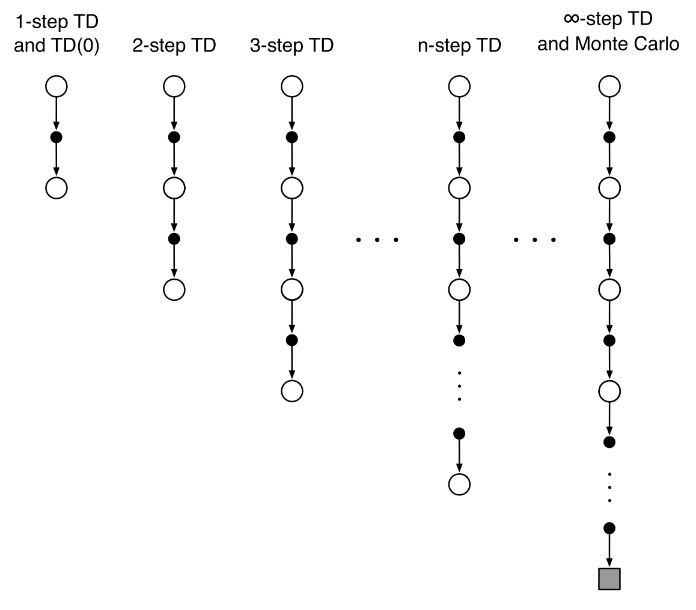
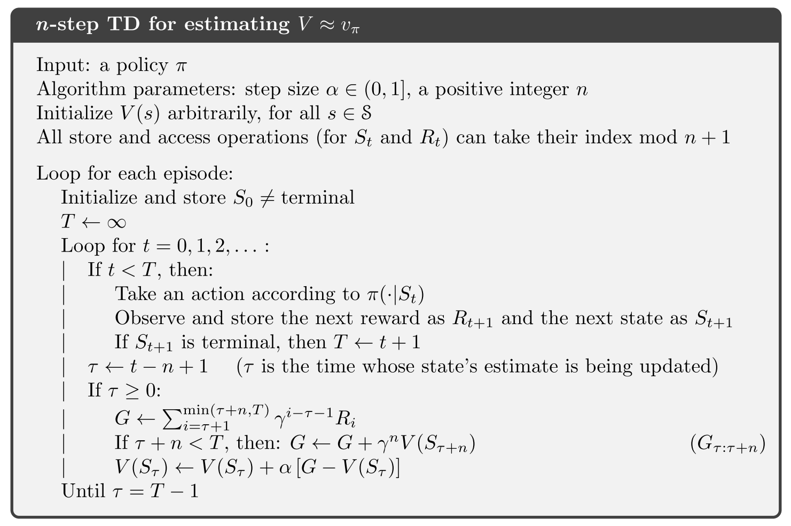
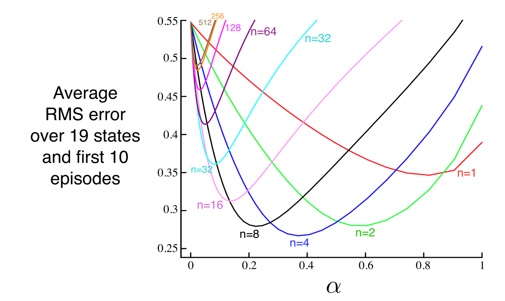
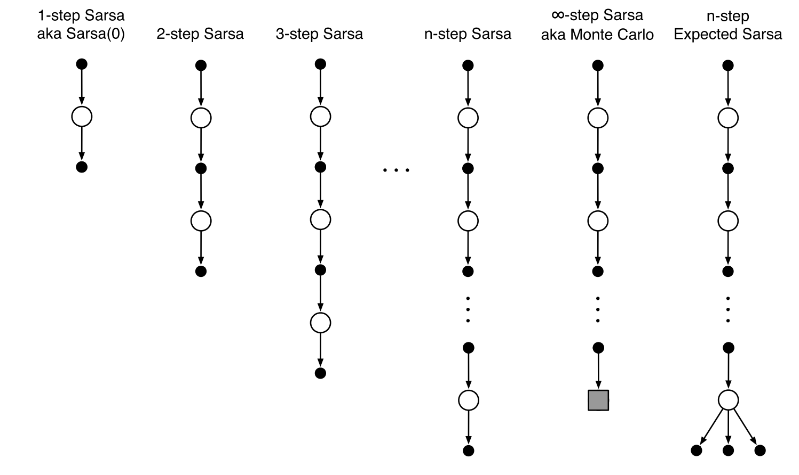
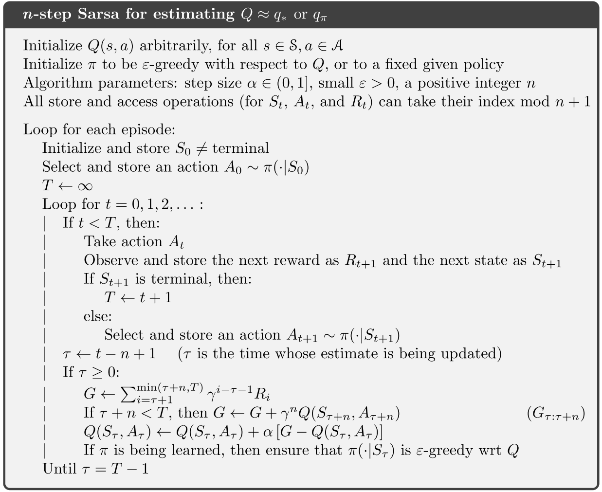
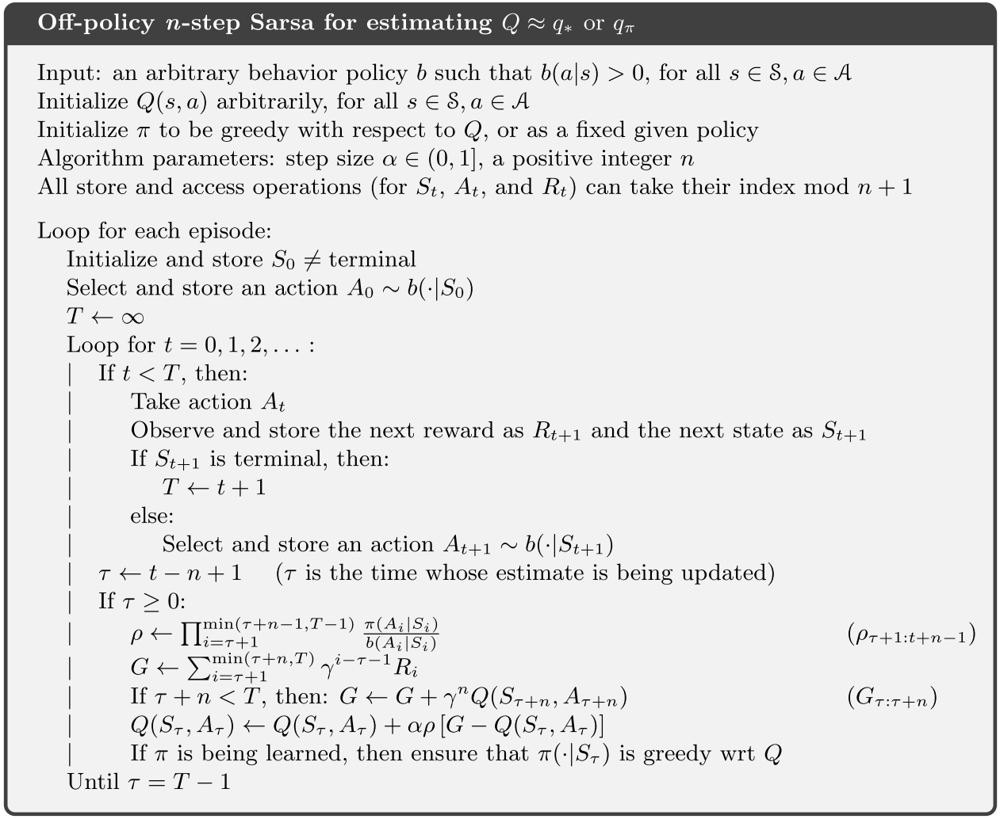
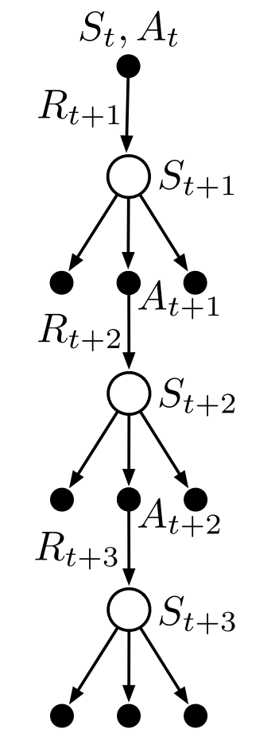
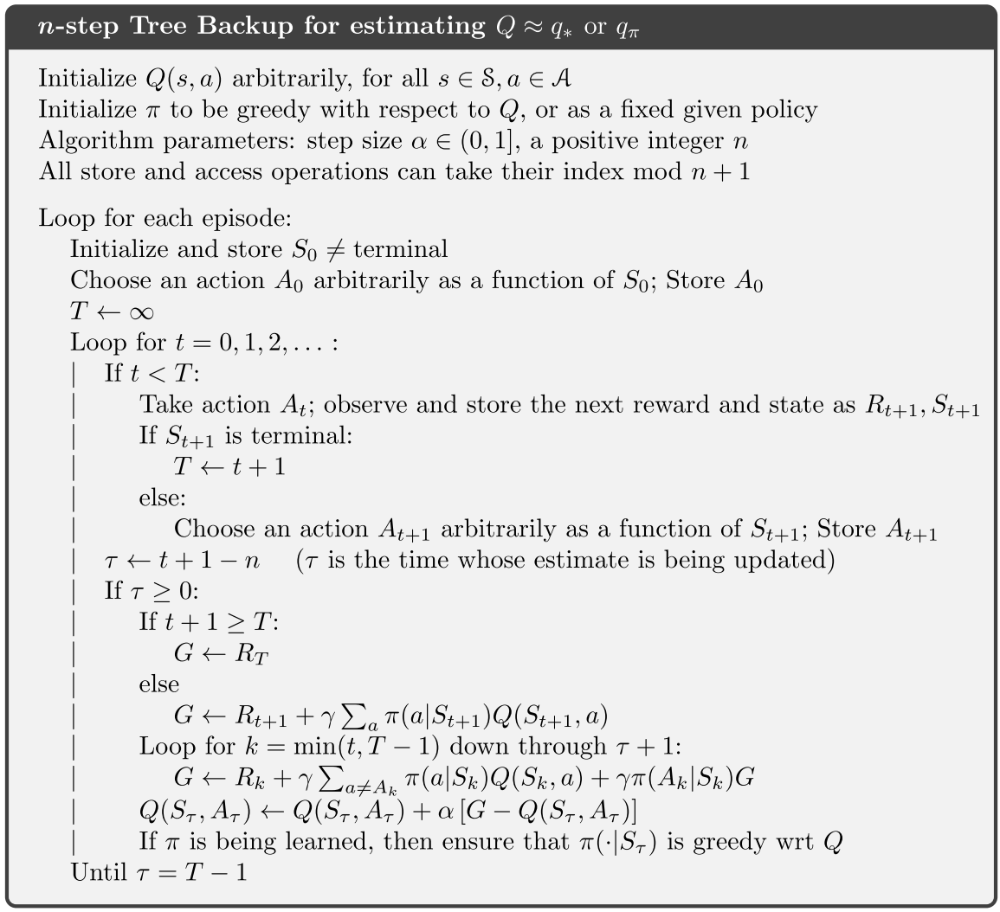

# 强化学习导论（七）- n 步自助法

这一章内容较少，主要是将前面的 MC 和 1-step TD 方法做了一个整合，提出了 **n-step TD 方法**。

## 7.1 n-step TD Prediction

我们将每隔 n 步做一次时序差分的方法称为**n-step TD 方法**。

从上图可以看出，第六章的方法是 1-step TD ，第五章的 MC 方法则可看作 $\infty$-step TD 。

### n-step return

我们将下面这样的返回值定义为 n-step 返回值：

$$
G_{t:t+n}\doteq \color{red}{R_{t+1}+\gamma R_{t+2}+\cdots+\gamma^{n-1}R_{t+n}}+\color{blue}{\gamma^nV_{t+n-1}(S_{t+n})}
$$

显然可知，只有当 $R_{t+n}$ 和 $V_{t+n-1}$ 都确定好后才能得到 $G_{t:t+n}$ 。

### n-step TD

将上面的 n 步返回值用于算法更新式，可以得到 n 步 TD 算法

$$
V_{t+n}(S_t)\doteq V_{t+n-1}(S_t)+\alpha[\color{red}{G_{t:t+n}}-\color{blue}{V_{t+n-1}(S_t)}]
$$

由于 n 步返回值只在一定时间后才能求出，所以也会影响到这一算法，因此在前 n 步都不会作更新。

**error reduction property**:

上面的 n-step TD 方法的收敛性由 error reduction property 这一性质来保证：

$$
\max\limits_s\left|\mathbb{E}_\pi[G_{t:t+n}|S_t=s]-v_\pi(s)\right|\leq \gamma^n\max\limits_s\left|V_{t+n-1}(s)-v_\pi(s)\right|
$$

有了这个性质，理论上可以证明 n-step TD 确实能够收敛。

## 7.2 n-step Sarsa

将 n-step return 加入到 Sarsa 算法的更新式中，即可得到 n-step Sarsa 算法。

$$
G_{t:t+n}\doteq \color{red}{R_{t+1}+\gamma R_{t+2}+\cdots+\gamma^{n-1}R_{t+n}}+\color{blue}{\gamma^nQ_{t+n-1}(S_{t+n},A_{t+n})}
$$

$$
Q_{t+n}(S_t,A_t)\doteq Q_{t+n-1}(S_t,A_t)+\alpha[\color{red}{G_{t:t+n}}-\color{blue}{Q_{t+n-1}(S_t,A_t)}]
$$

此外，期望 Sarsa 算法也类似

**Expected Sarsa**:

$$
G_{t:t+n}\doteq \color{red}{R_{t+1}+\gamma R_{t+2}+\cdots+\gamma^{n-1}R_{t+n}}+\color{blue}{\gamma^n\bar{V}_{t+n-1}(S_{t+n})}
$$

其中

$$
\bar{V}_t(s)\doteq \sum_a\pi(a|s)Q_t(s,a)
$$

## 7.3 n-step Off-policy Learning

n-step 的 Off-policy 学习也可以很方便地表示为类似的形式，只需要乘上一个重要性权重即可：

$$
V_{t+n}(S_t)\doteq V_{t+n-1}(S_t)+\alpha\rho_{t:t+n-1}[\color{red}{G_{t:t+n}}-\color{blue}{V_{t+n-1}(S_t)}]
$$

$$
\rho_{t:h}\doteq \prod_{k=t}^{\min(h,T-1)}\frac{\pi(A_k|S_k)}{b(A_k|S_k)}
$$

**n-step Off-policy Sarsa**:

$$
Q_{t+n}(S_t,A_t)\doteq Q_{t+n-1}(S_t,A_t)+\alpha\rho_{t+1:t+n}[\color{red}{G_{t:t+n}}-\color{blue}{Q_{t+n-1}(S_t,A_t)}]
$$

## 7.4 *Per-decision Methods with Control Variates

前面提到的算法在理论上都比较简洁易算，如下式

$$
G_{t:h}=R_{t+1}+\gamma G_{t+1:h}
$$

但在实际使用中，离线学习可能存在一些效率上的问题，这是因为如果在重要性采样过程中，如果重要性权重 $\rho$ 一直较低，此时更新量太小，甚至可以认为没有在更新，所以这会严重影响更新式的更新效率。

一个比较直观简洁的考虑是，采取下式来计算返回值：

$$
G_{t:h}\doteq \rho_t(R_{t+1}+\gamma G_{t+1:h})+(1-\rho_t)V_{h-1}(S_t)
$$

这样，当 $\rho$ 较大时，返回值的计算结果和之前的原始结果相近；而当 $\rho$ 较小时，则会直接采用一个旧的估计 $V_{h-1}(S_t)$  去计算和更新，而不是像之前那样几乎不做更新。

## 7.5 Off-policy Learning Without Importance Sampling: The n-step Tree Backup Algorithm

离线学习是否可以不引入一个新的 behavior 策略呢？上一章讲 Q-learning 时已经提过，先作整体估计再采取行动的方法，其实就可以看作离线学习策略，而这一章更广义地将这类方法定义为“n-步树回溯法”，即在每步行动前，对所有分支进行整体估计然后做更新，更新之后再采取一个具体行动，这个算法的示意图如下图所示

$$
\begin{aligned}
G_{t:t+1}&\doteq R_{t+1}+\gamma \sum_a\pi(a|S_{t+1})Q_t(S_{t+1},a)\\
G_{t:t+2}&\doteq R_{t+1}+\gamma \sum_{a\neq A_{t+1}}\pi(a|S_{t+1})Q_t(S_{t+1},a)\\
&+\gamma \pi(A_{t+1}|S_{t+1})\left(R_{t+2}+\gamma \sum_a\pi(a|S_{t+2})Q_{t+1}(S_{t+2},a)\right)\\
&=R_{t+1}+\gamma\sum_{a\neq A_{t+1}}\pi(a|S_{t+1})Q_{t+1}(S_{t+1},a)\\
&+\gamma\pi(A_{t+1}|S_{t+1})G_{t+1:t+2}\\
\vdots\\
G_{t:t+n}&\doteq R_{t+1}+\gamma\sum_{a\neq A_{t+1}}\pi(a|S_{t+1})Q_{t+n-1}(S_{t+1},a)\\
&+\gamma\pi(A_{t+1}|S_{t+1})G_{t+1:t+n}\\
\end{aligned}
$$

## 7.6 *A Unifying Algorithm: n-step $Q(\sigma)$

这一小节，将多种算法从理论上进行了公式上的统一，此处不再细讲。