# 强化学习导论（八）- 规划与学习

这一章全面地对前面几章的算法做了综合性的分类、总结和对比。

## 8.1 Models and Planning

### 模型（Model）

**模型**指学习者能够用来基于环境预测行为的反馈情况。简单而言，模型就是『**先验**知识』。

- 分布模型（distribution models）：描述了各种状态转移以及奖励反馈的概率，也就是提供了具体的分布 $p(s',r|s,a)$ 。
- 样本模型（sample models）：基于概率产生**一种**随机结果。

不难想象，如果结合提供的策略，样本模型能够产生完整的 episode ，而分布模型理论上能够生成所有可能的 episode 。所以，『模型』也可以被看作是对环境的模拟，进而生成出『模拟经验』。

### 规划（Planning）

**规划**，指**将模型作为输入，进而与之交互，对策略进行优化改进的计算过程**。

主要有两种不同类别的规划：

- state-space planning ：在状态空间中，通过计算各种状态值、行为值，来找到能够取得最优策略的转移方法。
- plan-space planning ：重新将问题定义在一种『plan 空间』。这种方法比较抽象，难以实现，本书不会对其进行进一步的探讨。

规划方法的两个基本思想：

1. 将 value functions 的计算作为改进策略的关键中间步骤。
2. 通过在模拟出来的经验上的更新、反馈等操作，来计算 value functions 。

规划（Planning）方法和后面要提到的学习（Learning）方法核心思想都一样：通过反向更新来估计价值函数。区别仅在于，前者通过 model 生成**模拟经验**数据，而后者直接与环境交互，生成**真实经验**经数据。

下面提供一个规划方法的例子（基于 one-step Q-learning 和 random model）：

## 8.2 Dyna: Integrated Planning, Acting, and Learning

这一节，主要讲一种 Dyna-Q 的结构，他将下面三种概念整合在一起：

- 『模型』：对环境的模拟。
- 『真实经验』：用于改进模型，使模型和真实环境更加匹配；也能用于直接改进价值函数和策略（比如 MC 方法）。
- 『价值函数 & 策略』：$v_\pi,q_\pi,\pi$ 等

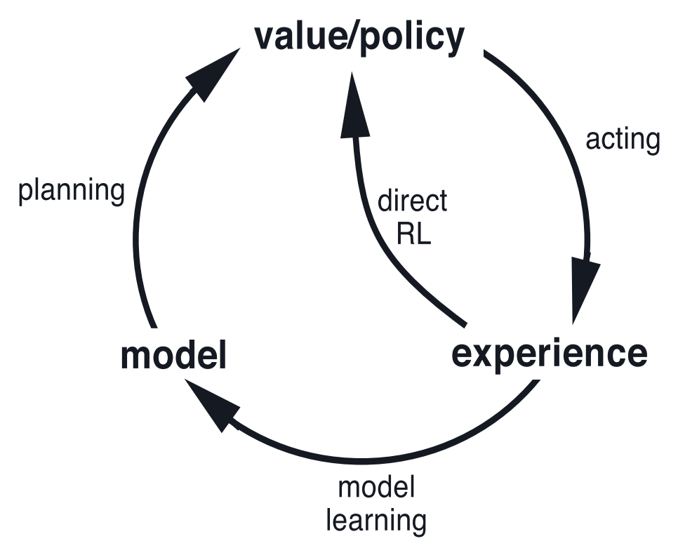

真实经验既可以被用来先改善模型，再做 planning 来调整 value function；也可以结合前面几章讲过的方法用来直接用于改进 value function 和 policy 。如上图所示，Dyna-Q 则将两种思路整合在一起，其中

- 规划方法采用了 random sample one-step tabular Q-learning
- 学习方法采用了 one-step tabular Q-learning

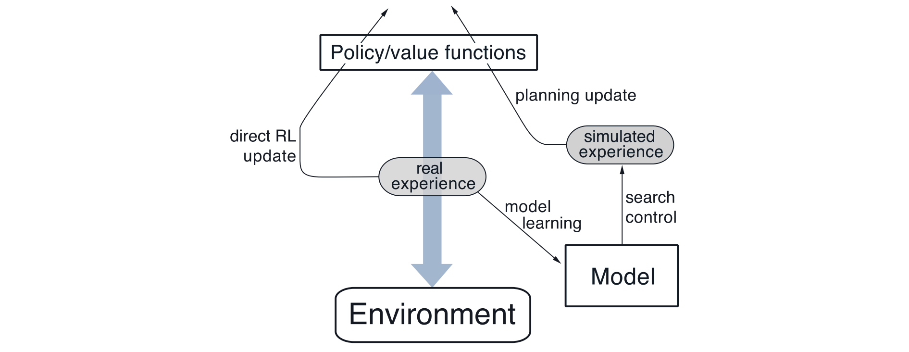

- 中间的 real experience 是算法的核心要素，通过与环境交互获得。
- 向左的箭头表示 direct RL 过程，通过真实经验数据**直接**更新 value function 和 policy 。
- 向右下的箭头表示 indirect RL 过程。先由真实经验数据改善 model ，再由 model 产生模拟经验数据，进而去更新 value function 和 policy 。

在 Dyna-Q 中，规划和学习的原理几乎一样，唯一的不同在于，前者使用模拟经验数据，后者采用真实经验数据，最终都使用 Q-learning 来进行学习。

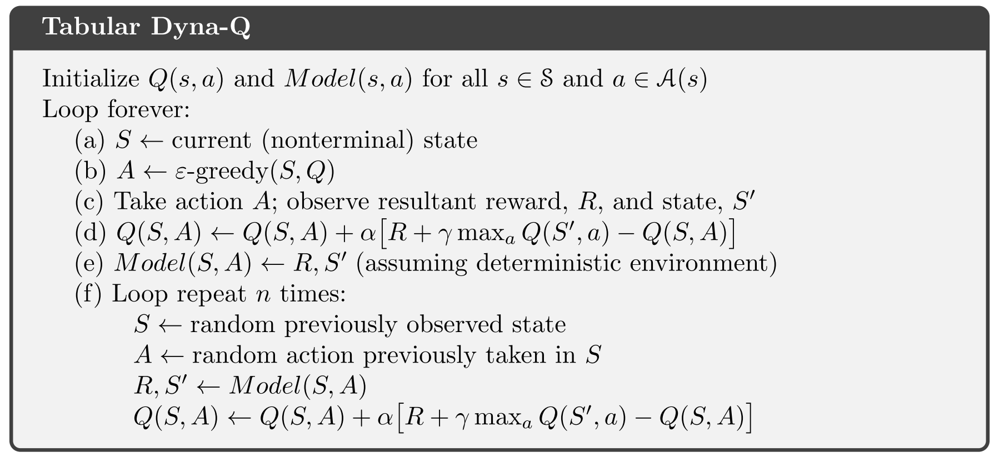

- （c） & （d） : direct RL
- （e） & （f） : model learning + planning

## 8.3 When the Model Is Wrong

有时问题的背景是不固定的，也就是『环境』可能发生变动，这时我们的 model 可能就是错误的模型，导致其后的规划过程无法得到理想的策略。

如果能够及时发现环境的变化，也就是发现原有的最优解已不是最优，进而重新开始探索，那么便能解决这一问题。

这一节我们提出 Dyna-Q+ 算法，其特点是：将『奖励值』与 『状态被访问次数』结合（而不是像之前只看奖励值），使算法一定程度上能够多考虑长期未被访问的状态（有点像第二章的 UCB 算法）。

具体的结合方法是，将 reward 重新设置为 $r+\kappa\sqrt{\tau}$ ，其中

- $r$ ：转移过程收到的奖励反馈。
- $\tau$ ：从上一次被访问开始，未被访问到的时间步数。
- $\kappa$ ：一个较小的系数。

这样，长期未被访问过的状态便能拥有一个更大的奖励值，更容易被算法访问到。

## 8.4 Prioritized Sweeping

在 Dyna-Q 算法的 (f) 步骤，在选择 S 和 A 时本来是随机选取，这样会存在一个问题，初始值一般设为 0 ，在算法的初始阶段，会大量访问到 value 为 0 的状态，此时『误差』为 0 ，也就不会产生更新，导致算法初期的规划学习效率低下。

如果能够在规划过程中，更有针对性地优先考虑那些 value 发生过较明显改变的状态，便能提升规划学习的效率。

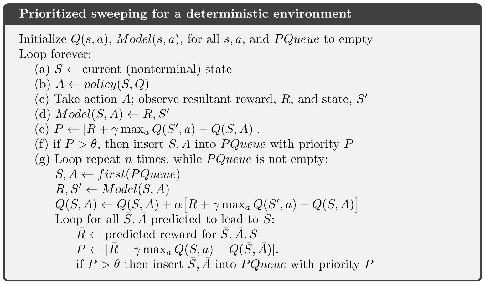

- 以 value 的改变量为指标，对访问过的 state-action pair 进行优先级排序。
- 构造一个优先级队列 PQueue ，存储每次满足条件的状态和行动。

## 8.5 Expected vs. Sample Updates

前面的 Dyna-Q 算法中，更新方法是 Sample Updates ，也就是选取某一个具体的 sample 来更新价值函数，于其对应地，就是 Expected Updates ，对下一步所有可能的 actions 都遍历一次，按概率分布取得期望后更新价值函数。

下图是几作常见的价值函数在两种 Update 方法下的示意图：

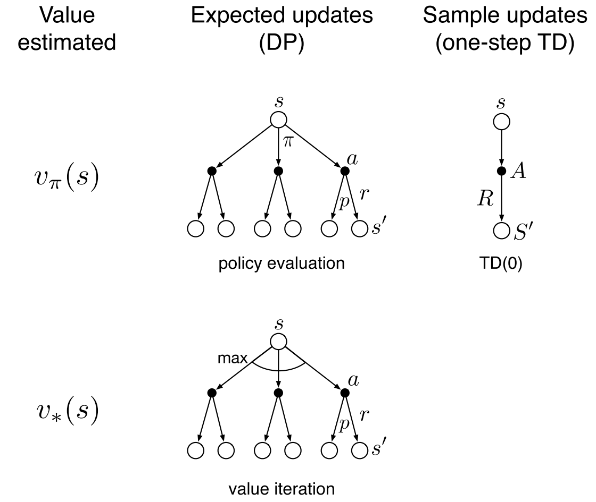

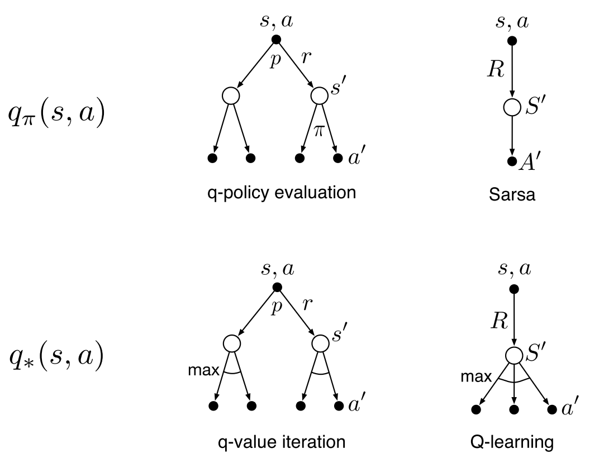

下面对比两种更新方法。

- 如果没有 model ，那么无法使用 expected updates ，只能和环境交互，做 sample updates 。
- 如果有 model ，expected updates 的估计准确性更高，避免了采样误差，而 sample updates 的运算量则会很小，速度快。

以一个实例来进行说明，设 model 为 $\hat{p}(s'|s,a)$ ，期望奖励为 $\hat{r}(s,a,s')$ 。

则 expected updates 的更新式为
$$
Q(s,a)\leftarrow \sum_{s'}\hat{p}(s'|s,a)[\hat{r}(s,a,s')+\gamma \max_{a'}Q(s',a')]
$$
sample updates 的更新式为
$$
Q(s,a)\leftarrow Q(s,a)+\alpha[\hat{r}(s,a,s')+\gamma \max_{a'}Q(S',a')-Q(s,a)]
$$

这里再引入一个变量 $b$ ，表示当前状态的下一步有多少种可能的状态，意义上代表了环境状态的随机程度，而环境随机程度也正是 expected updates 和 sample updates 的重要区别因素。

- 若 $b=1$ ，则两者没有区别；
- 若 $b$ 较大，expected updates 的准确度只受状态值函数 Q 的准确性的影响，sample updates 则既受 Q 的准确性的影响，也受采样误差的影响。

此外，expected updates 的计算量约为 sample updates 的 $b$ 倍。

下面看一组对比两种方法性能的实验。

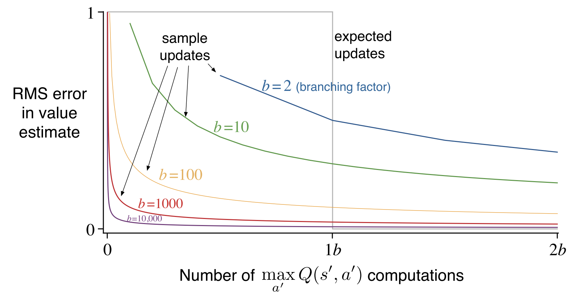

- 假定用于更新的 value function 是**完全准确**的。
- 对于 expected updates，在 $b$ 确定的情况下，更新的时间是固定的，更新完成后，误差为 0 。
- 对于 sample updates ，随着 $b$ 的增大，其相比于 expected updates 的优势则渐渐体现出来（较快收敛）。

## 8.6 Trajectory Sampling

这一节主要解决『**如何取选**取哪些状态、行动用于更新价值函数』这一问题。

在经典的 DP 中，算法是直接选取了所有状态，全部状态都赋予了相同重要程度，而未作区分，在实际情况下，很多状态的出现概率很低，而 DP 显然浪费了很多时间在很多这样不必花太多精力去更新的状态。

为了避免这类问题，考虑以某种『合适的』概率分布在状态空间中采样，避免『盲目性』。

一种更有效的采样方式为：根据当前策略的概率分布进行采样操作。称这样的采样方法为 Trajectory Sampling 。

下面看一组对比 Trajectory Sampling 与 Uniform Sampling 的效率对比实验。实验中统一使用 expected updates：
$$
Q(s,a)\leftarrow \sum_{s'}\hat{p}(s'|s,a)[\hat{r}(s,a,s')+\gamma \max_{a'}Q(s',a')]
$$

- Uniform Sampling ：从整个 state-action 空间随机采样，并进行更新操作。
- Trajectory Sampling ：先生成模拟序列（状态和奖励由 model 确定，行为由策略确定），然后对模拟序列出现的每个 state-action 进行更新。

下面是对比实验，横轴表示计算时间，纵轴表示 $v_{\tilde{\pi}}(s)$ 。

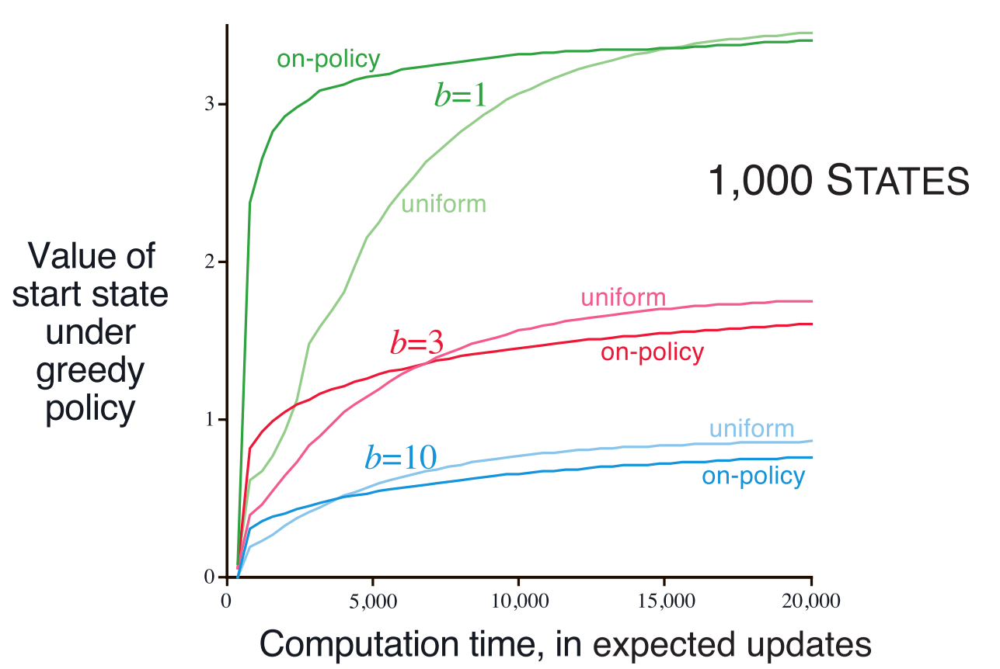

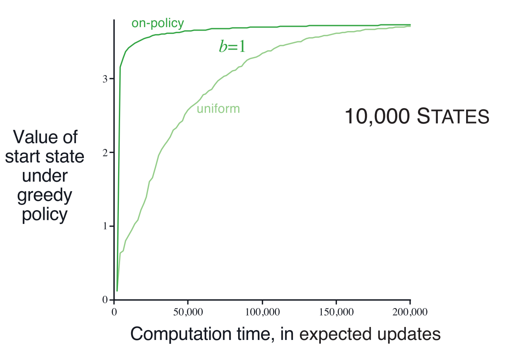

- Trajectory Sampling 在初始阶段速度很快，但后期效果一般。
- $b$ 越小，Trajectory Sampling 速度优势越明显。
- 状态总数越大，Trajectory Sampling 速度优势越明显。

初期，路径采样更集中于对那些和初始态相关度进行更新，所以效率很高，但到了后期，所有状态对应的 $Q(S)$ 已经都较为准确，无需再进行有倾向性的采样，但路径采样仍去频繁地对他们采样，所以效率较低。

## 8.7 Real-time Dynamic Programming

**实时动态规划**（RTDP）是 on-policy trajectory-sampling DP 算法（就是将上一节的 Trajectory Sampling 整合进 DP 算法）。他是一种异步动态规划（asynchronous DP），异步动态规划不像常规的 DP 那样对状态空间进行彻底性的扫描，而是任意规定一种顺序来扫描。

RTDP 允许跳过一些与问题目标无关的状态，同样也能收敛到最优策略。虽然在前面章节提过，常规的 DP 算法如果想要取得最优策略，需要对每种状态都要更新无穷次，才能确保收敛。但是，对于一些满足特定条件的情况和问题，RTDP 在忽略一些状态的情况下，仍然能够以概率 1 收敛到最优策略：

1. 想要达到的目标状态的初始值为 0 。
2. 至少存在一个策略，使得任意初始状态都以概率 1 达到目标状态。
3. 所有从非目标状态出发的转移过程对于的 reward ，都必须严格小于 0 。
4. 所有初始 value 都要大于等于最优情况下的 value （显然将初值全部设为 0 即可满足）。

拥有上述性质的任务，称为**随机最优路径问题**（stochastic optimal path problems），主要指那些需要将**代价最小化**的问题，而不是使收益最大化。

RTDP 高度关注与问题相关的状态子空间，其效率较高，与普通的全扫描迭代相比，时间要少 50% 。

## 8.8 Planning at Decision Time

- 前面主要讲的方法（称为 background planning）：使用模拟经验数据来渐渐地改善策略和价值函数。
- 本节的 decision-time planning ：使用模拟经验数据，结合已知信息，直接选出当前状态下的最优策略。

Decision-time planning 的优点在于，他重点关注了即时状态，而没有太注重综合性的信息。由于在一些问题中，一些状态出现一次后要很长时间才能再出现一次，这时 decision-time planning 就能较好地处理这种情况。

Decision-time planning 适合那些不太需要快速反应的场景，比如一些棋类游戏，在每一步都允许较多思考时间。

## 8.9 Heuristic Search

启发式搜索在访问到一个状态时，会建立一棵后续可能情况的树，然后利用树中的信息进行更新。

搜索树越深，每一次更新时的信息量也更大，显然更深的启发式搜索能够生成更好的结果。通常来说，如果搜索深度 $k$ 能使 $\gamma^k​$ 非常小的话，最终得到的 action 也会非常接近**最优解**，然而此时**计算量**会非常大，因此需要找到一个**合适的平衡点**。

常用的构造高效搜索树的方法是：下一步中，有希望成为最优 action 的分支，就增加搜索深度；而不太可能去采取行动的 action ，就将分支深度适当降低。

启发式搜索的核心思想正如上一节的 decision-time action 中的思想，即重点关注当且（或者与当且较近）的状态，所以搜索树的构造思路也应是**如何更好地去更新当且状态值**。

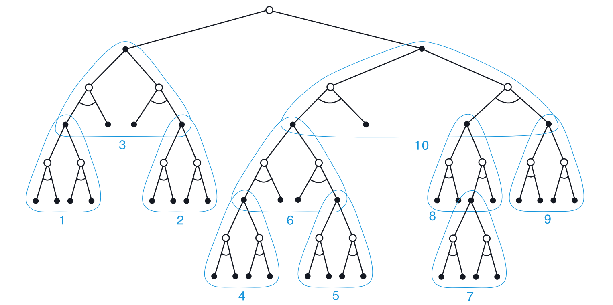

## 8.10 Rollout Algorithms

Rollout 算法其实就是将 decision-time planning 整合进 Monte Carlo 方法的算法。

Rollout 算法对当前状态，从各个 action 出发，根据策略分别进行采样，通过样本数据来进行计算和更新。

- MC 中，采样是为了逐步使信息更准确，进而更准确地改善策略。
- Rollout 中，采样是采出每一步之后的一定信息，利用信息更新后，然后做出选择让这一步进入下一个状态（思想依然是主要关注当前状态）。

## 8.11 Monte Carlo Tree Search

蒙特卡罗树搜索（MCTS）是对上一节 Rollout 算法的进一步拓展，他会在其基础上记录搜索过程中的行动值变化，以便更好地采样。他的核心思想是：设法重点关注从当前状态出发后有高估值的路径。其主要步骤为：

1. 选择：从根节点出发，根据**树策略（tree policy）**选择一个叶节点。
2. 拓展：有一定概率从选择的叶节点中执行一个未执行过的行动来增加一个子节点。
3. 模拟：从当前叶节点开始，根据 rollout 策略执行动作直到终止时间。
4. 回溯：利用本次模拟中得到的奖励和逐层更新所使用到的树内节点。

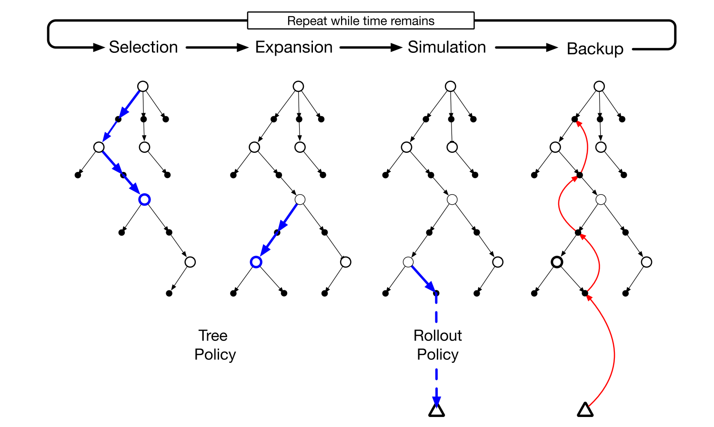

MCTS 常用在双人竞技游戏，比如围棋，2016 年战胜人类冠军围棋手的 AlphaGo 正是大量用到了这一算法。